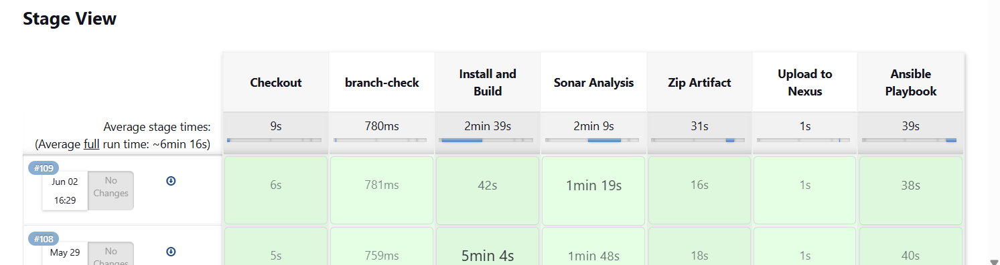
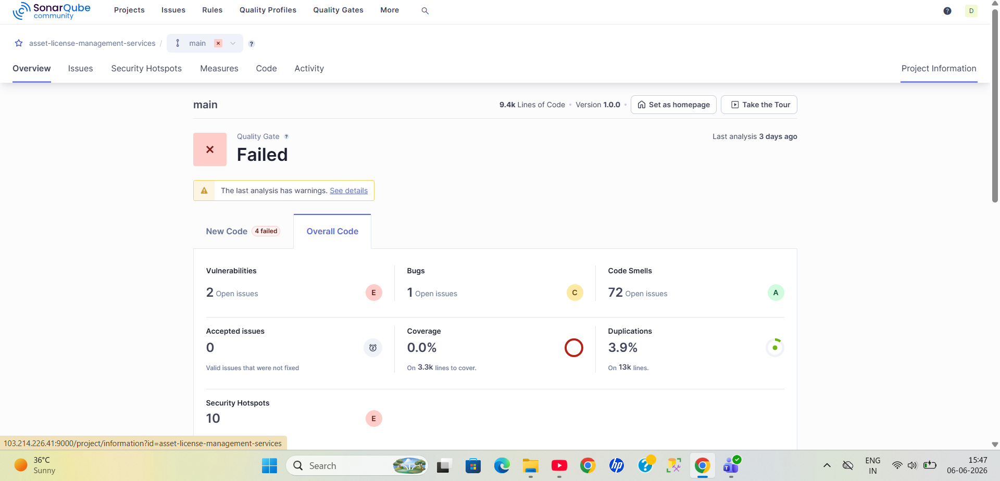
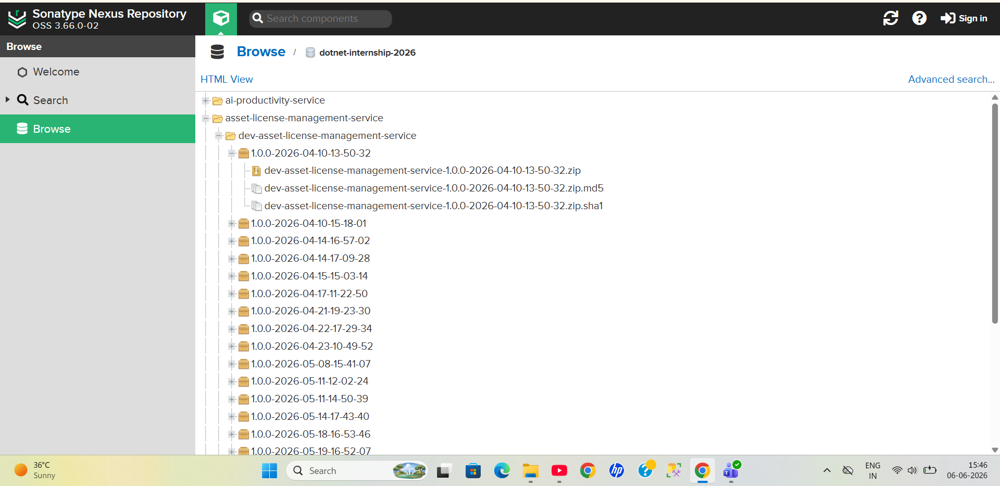

# dotnet-iis-deployment

CI/CD pipeline for IIS-hosted .NET applications using Jenkins, SonarQube, Nexus Repository, and automated IIS deployment through Ansible.

The pipeline automates: 

- Source code checkout

- Application build and publish

- Static code analysis using SonarQube

- Artifact packaging and versioning

- Artifact upload to Nexus Repository

- Automated IIS deployment using Ansible

- Health check validation

- Rollback to previous stable artifact on deployment failure
  
- The deployment workflow was designed to support reusable deployments across Dev and QA environments using dynamic runtime variables passed from Jenkins to Ansible playbooks.

- In addition to CI/CD automation, SQL Server environments were configured using SQL Server Management Studio (SSMS) and SQL Server Configuration Manager.

- Database access and permissions were managed by assigning: - DB Owner privileges to the Data Team - Read, Write, and Execute permissions to Dev and QA teams

# Technologies Used

| Technology | Purpose | 
 
| Jenkins | CI/CD Pipeline Automation | 

| Ansible | IIS Deployment Automation | 

| SonarQube | Static Code Analysis | 

| Nexus Repository | Artifact Management | 

| IIS | Application Hosting | 

| WinRM | Windows Remote Management | 

| SSMS | SQL Server Administration | 

| SQL Server Configuration Manager | SQL Server Configuration |

| .NET 8 | Application Framework | 

| Groovy | Jenkins Pipeline Scripting |

# CI/CD Workflow Architecture 

Developer Commit 

↓ 

Git Repository 

↓ 

Jenkins Pipeline 

↓

Windows Build Agent 

├── Restore Dependencies 

├── Build Application 

├── SonarQube Analysis 

├── Package Artifact 

└── Upload Artifact to Nexus 

↓ 

Ubuntu Deployment Agent 

↓ 

Ansible Playbook Execution 

↓ 

Windows IIS Server 

↓ 

Application Deployment 

↓ 

Health Check Validation

# CI/CD Pipeline Stages
## 1. Checkout Stage

The pipeline starts by pulling the latest application source code from the Gitlab repository using the configured branch and credentials.

*Activities
- Workspace cleanup
- Source code checkout
- Branch verification

---

## 2. Build & Publish Stage

The .NET application is restored, compiled, and published in Release mode.

*Activities
- Dependency restoration using `dotnet restore`
- Application build and publish using `dotnet publish`
- Generation of deployable publish artifacts

---

## 3. SonarQube Static Analysis

Static code analysis is integrated into the pipeline using SonarQube to identify:
- Bugs
- Vulnerabilities
- Code smells
- Duplicate code blocks

*Activities
- Sonar scanner initialization
- Build analysis
- Code coverage collection
- Quality validation

> Quality gate failures occurred due to unavailable test cases, but SonarQube was actively used for static analysis and code quality monitoring.

---

## 4. Artifact Packaging

After successful build and analysis, the published application files are compressed into versioned ZIP artifacts.

*Activities
- ZIP packaging of published output
- Timestamp-based artifact versioning
- Build traceability support

---

## 5. Nexus Repository Upload

Packaged artifacts are uploaded to Nexus Repository for centralized artifact management and deployment consistency.

*Activities
- Artifact version management
- Centralized storage
- Deployment-ready artifact distribution

---

## 6. Automated IIS Deployment using Ansible

Deployment automation is executed from an Ubuntu-based Jenkins agent using reusable Ansible playbooks targeting Windows IIS servers through WinRM.

*Activities
- Dynamic runtime variable passing
- IIS website creation
- IIS application pool management
- Artifact deployment
- Automated restart handling

---

## 7. Health Check Validation

After deployment, automated health validation is performed to verify application accessibility and deployment success.

*Activities
- Endpoint verification
- HTTP status validation
- Deployment confirmation

---

## 8. Rollback Mechanism

If deployment validation fails, the playbook automatically restores the previously stable artifact version.

*Activities
- Automatic rollback execution
- Previous artifact restoration
- Failed artifact cleanup
- Service recovery

  # Pipeline Execution

# SonarQube Analysis

# Nexus Artifact Repository

# Reusable Deployment Architecture 
The deployment workflow was designed using reusable and dynamic Ansible playbooks integrated with Jenkins runtime variables. 
Instead of maintaining separate deployment scripts for Dev and QA environments, the same deployment logic was reused by passing environment-specific variables dynamically during pipeline execution.

## Dynamic Runtime Variables 
The Jenkins pipeline passed deployment variables directly to the Ansible playbook during execution. 

### Example Runtime Variables 

-e "site_name=${SITE_NAME}"

-e "project_name=${ARTIFACT_ID}" 

-e "host_port=${PORT}"

## Ubuntu Deployment Agent

Responsible for:

Ansible playbook execution

WinRM communication

IIS deployment automation

Health validation

Rollback execution

This separation improved deployment organization and simulated enterprise deployment workflows.

## IIS Deployment Automation

The deployment playbook automated IIS management tasks including:

IIS website creation

Application pool creation

HTTPS binding configuration

Website restart handling

Deployment directory management

Deployment automation was executed remotely on Windows IIS servers using WinRM from the Ubuntu Ansible control node.

# Preserved Configuration & Log Retention Strategy

During deployment, important runtime configuration files and application logs were preserved to prevent loss of environment-specific settings and operational logs.

## Preserved Files

- web.config

- appsettings.Development.json

- appsettings.QA.json

- Logs directory

## Deployment Preservation Workflow

The deployment playbook automatically:

1. Backed up important configuration files

2. Preserved application logs

3. Removed old deployment files

4. Extracted the latest deployment artifact

5. Restored preserved configurations

6. Restarted IIS services

This ensured deployment consistency without losing environment-specific runtime configurations.

---

# Automated Log Retention Management

After discussions during daily stand-up meetings, environment-specific log retention strategies were implemented for Dev and QA environments.

## Retention Policy

| Environment | Log Retention |

| Dev | 7 Days |

| QA | 15 Days |

## Log Cleanup Automation

Automated cleanup scripts were configured using Windows Task Scheduler to manage old log files.

### Workflow

- Log cleanup tasks executed automatically on scheduled intervals

- Older logs exceeding retention limits were deleted automatically

- New logs continued to be generated without manual cleanup

- Storage utilization was managed efficiently

### Example

For the Dev environment:
- Latest 7 days of logs were retained

- When new logs were generated on the 8th day, the oldest log files were automatically removed

The same automated retention logic was implemented for the QA environment with a 15-day retention policy.

# Rollback Strategy 
The deployment playbook was designed with automated rollback support to reduce deployment downtime and recover quickly from failed deployments.

## Rollback Workflow
If deployment validation fails: 

1. The failed deployment is stopped

2. IIS website and application pool are stopped

3. The failed deployment files are removed
  
4. The previously stable artifact is restored automatically

5. Preserved configuration files are restored

6. IIS services are restarted

7. Failed artifacts are cleaned up

This ensured deployment reliability and reduced manual recovery effort. 

# Artifact Retention Strategy 
The deployment workflow maintained deployment consistency by automatically managing old artifacts.

## Artifact Cleanup Logic 
- Latest deployment artifacts were preserved

- Older artifacts were automatically deleted

- Failed deployment artifacts were removed during rollback This helped optimize server storage usage while maintaining rollback capability.

----

# Database Administration Responsibilities
SQL Server administration tasks were performed using: 

- SQL Server Management Studio (SSMS)

- SQL Server Configuration Manager

## Access Management 

### Data Team 
- DB Owner permissions

### Dev and QA Teams
- Read permissions

- Write permissions

- Execute permissions

This ensured controlled access management across environments.

# Automated Database Backup Strategy 
Automated database backup operations were implemented on the Windows IIS server using Windows Task Scheduler and batch scripting. 
The backup workflow was designed to perform scheduled database backups daily without requiring active user login sessions. 

## Backup Workflow 
1. Database backup scripts executed automatically using Windows Task Scheduler

2. Tasks were configured to run at a scheduled time every day
  
3. Backups executed whether the user was logged in or not
   
4. Generated backup files were transferred automatically to another system over the internal network
   
5. Backup storage was maintained on a separate machine for recovery and redundancy purposes
         

## Key Objectives
- Automated backup management

- Daily database backup scheduling

- Backup redundancy

- Recovery preparedness

- Reduced manual operational effort

# Key Learning Outcomes 
This project provided hands-on experience with: 

- Enterprise CI/CD workflows -

- Jenkins multi-agent pipelines

- IIS deployment automation

- Ansible automation for Windows servers

- SonarQube integration

- Nexus artifact management

- Rollback handling strategies

- Dynamic deployment architecture

- WinRM-based remote deployments

- Environment-specific deployment management

--- 

# Disclaimer
> This repository is a sanitized educational showcase inspired by enterprise DevOps workflows implemented during internship experience.
> > All sensitive information, internal infrastructure details, credentials, IP addresses, and proprietary assets have been removed or generalized for security purposes.
